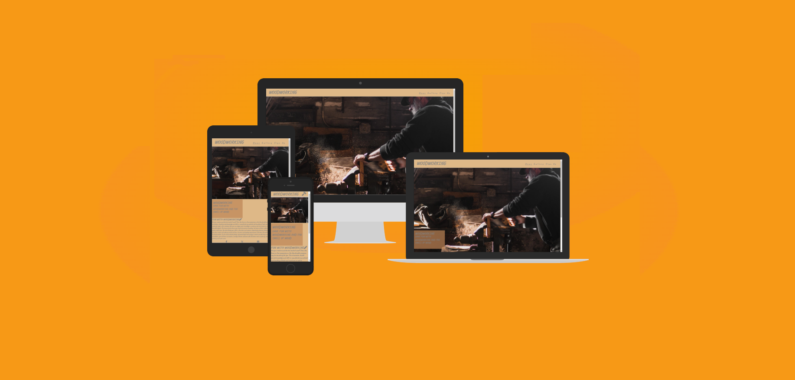

WELCOME,
This is the Woodworking. In case you like woodworking and the smell of worked wood, you have come to the right place.

# Table of contents

- [Table of contents](#table-of-contents)
- [UX](#ux)
- [Design](#design)
- [Features](#features)
- [Testing](#testing)

# UX

SITE PURPOSE

To provide information on woodworking for people of all levels who to want to learn and improve their craft in woodworking.

SITE GOAL

Can come in here and become a member. Get infrormtion and lessons in woodworking. Share experience and pictures.

AUDIENCE

Anyone who wants to learn woodworking is welcome, young and old.

CURRENT USER GOAL

To be able to share experiences with each other and become better together.

NEW USER GOAL

To be able to learn new things in woodworking.
By registering on the website, as a new member you can get a lot of new information and tips.

# Design

WIREFRAMES

I cerated my wireframes by hand

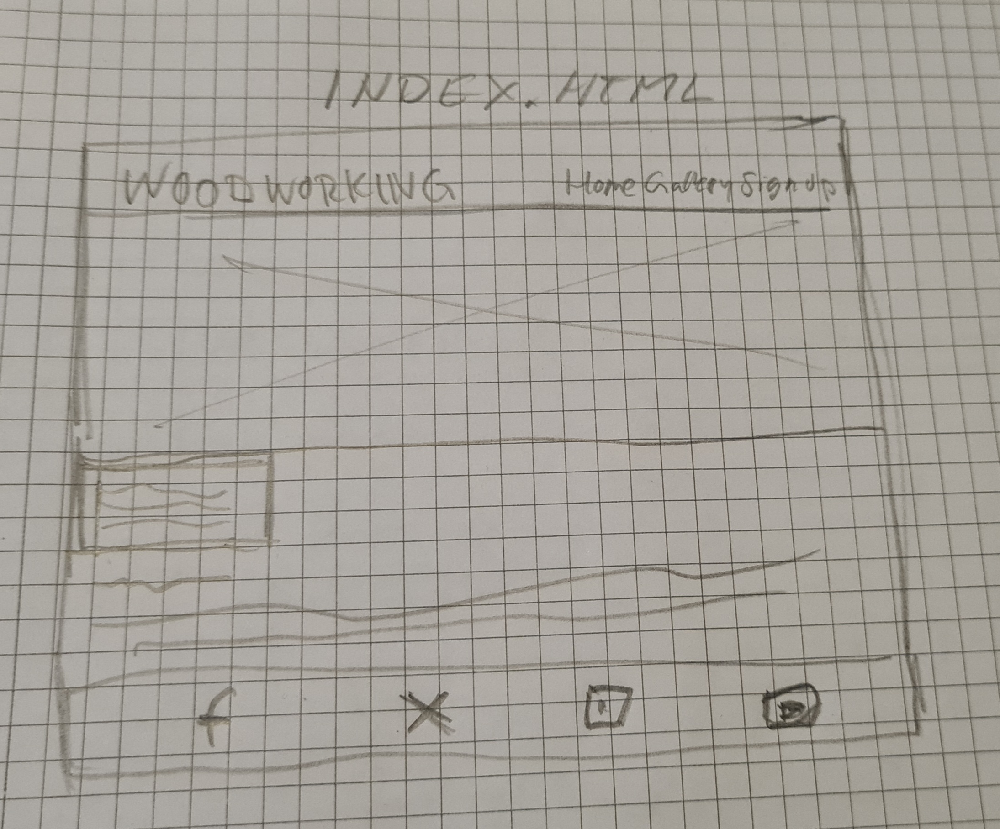
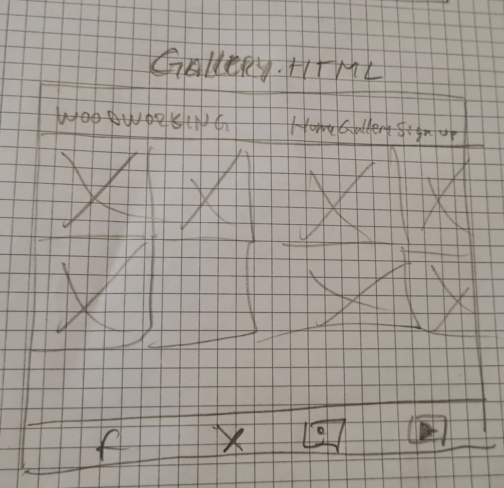
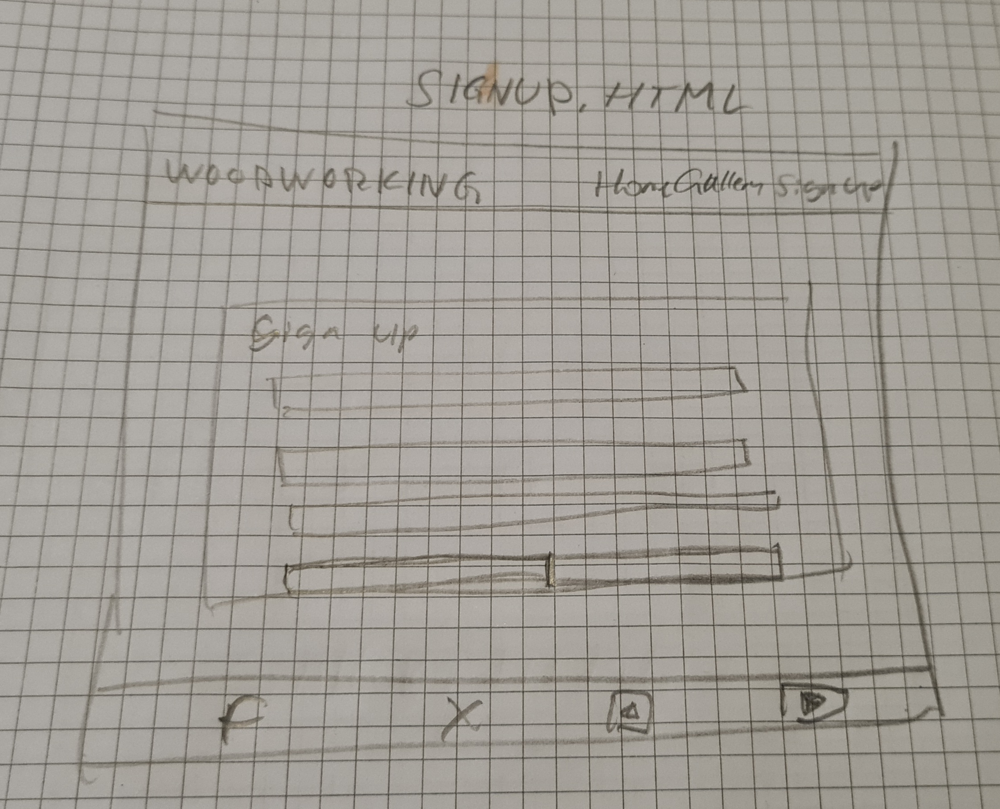

COLOUR PLATTE

The colour palette was sourced from [coolors](https://coolors.co/).
I chose colors inspired from woodworking.
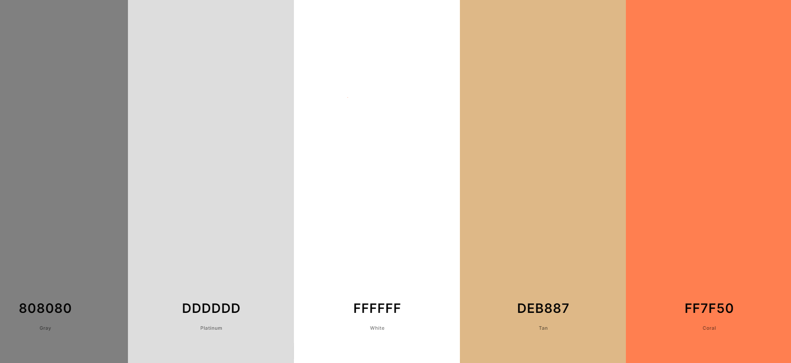

TYPOGRAPHY

My typography was sourced from [Google Fonts](https://fonts.google.com/).
 
IMAGERY

All imagery for the website has been sourced from [unsplash.com](https://unsplash.com/) which are free photo stock platforms. I specifically wanted to show imagery of all the stages of woodworking, so the audience can get an understanding of the homepage.

# Features
LANGUAGES  USED
- HTML 
- CSS

NAVIGATION BAR

This is included on all three pages and provides an easy structure for the audience to be able to use.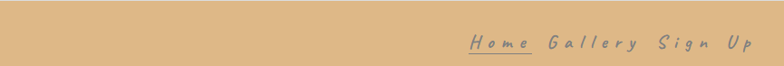 This is a responsive feature and remains this way, until 768px and down where the navigation bar moves under logo,, so the design of both of these features isn't compromised.

LANDING PAGE

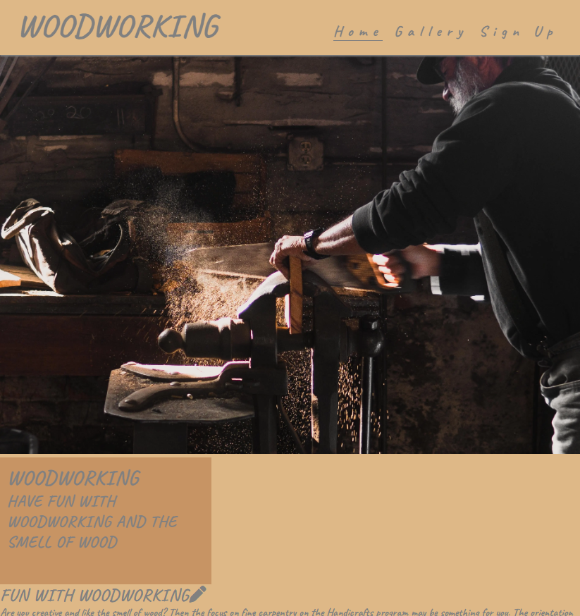

The landing page is displayed above.

FOOTER

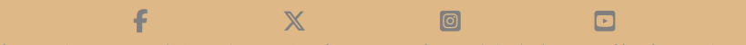

The social links all sit within the footer, which you are able to click and they will take you to the intended social media platform.

# Testing
VALIDATION TEST

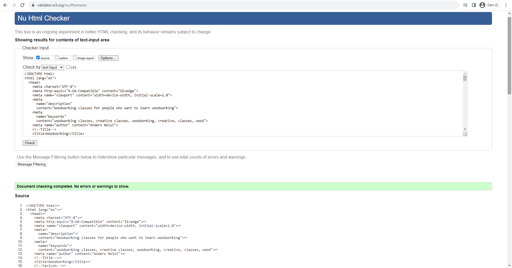

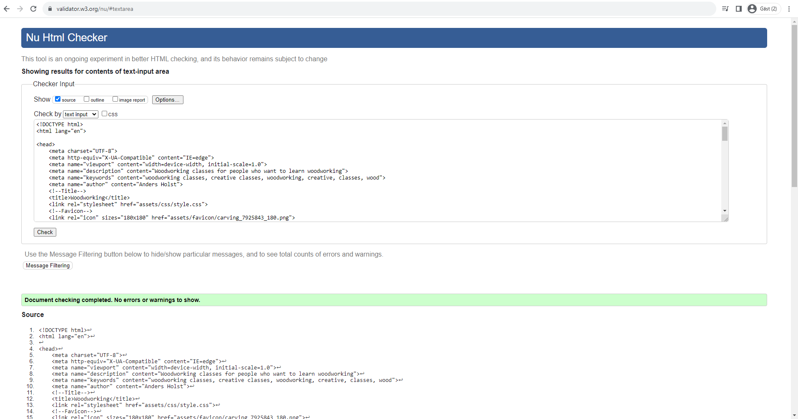
![signup val]
- all of my html pages have been put through the w3c html tester and passed.
  
![css val]
- all of the css code has been put through w3c tester and has passed.

LIGHTHOUSE TEST

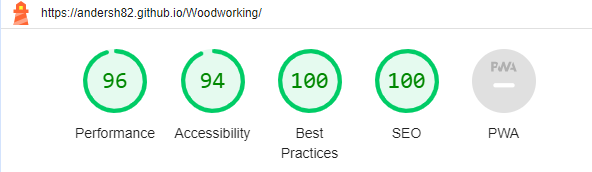
- my page rating for desktop
 
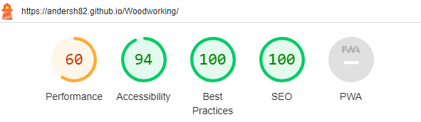

- my page rating for mobile

LIBRARIES AND PROGRAMS USED
- Github: Store Repository
- Codeanywhere: To create the html and css file
- Google Fonts: Font family 'Playfair Display' and 'Source Sans'
- Google Chrome Dev Tools: To help with styling the media queries
- Safari: Site testing on an alternative browser
- Font Awesome: Social media icons
- Am I responsive: Screenshots of the final project for the README file
- 

MEDIA
All of my images are sourced from unsplash.com

Tanks to:

- Alexandre Jaquetoni
- Alex Jones
- Bailey Alexander
- barn images
- Carlo Borella
- Cristina Gottardi
- Dominik-Scythe
- Ipek Aydogdu
- Jonathan Taylor

