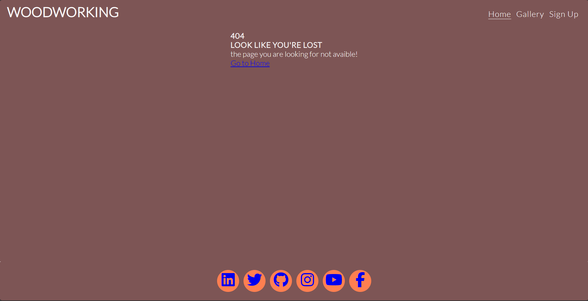

I would just like to state that I am not the best at English, so if there are spelling, grammatical errors, or mistakes, please bear with me.

# Welcome

This is woodworking. If you like woodworking and the smell of worked wood, you have come to the right place.

# Table of contents

- [Welcome](#welcome)
- [Table of contents](#table-of-contents)
- [User stories](#user-stories)
    - [Site Purpose](#site-purpose)
    - [Home Page](#home-pagel)
    - [Gallery Page](#gallery-page)
    - [Sign Up Page](#sign-up-page)
    - [Footer](#footer)
    - [Responsive Design](#responsive-design)
    - [Accessibility](#accessibility)
- [Design](#design)
  - [Wireframes](#wireframes)
  - [Colour Platte](#colour-platte)
  - [Typography](#typography)
  - [Imagery](#imagery)
- [Features](#features)
  - [Languages  Used](#languages--used)
  - [Navigation Bar](#navigation-bar)
  - [Footer](#footer)
  - [The Completed Page](#the-completed-page)
- [Testing](#testing)
  - [Validation Test](#validation-test)
  - [LIGHTHOUSE TEST](#lighthouse-test)
  - [Libraries And Programs Used](#libraries-and-programs-used)
- [Deployment \& Usage](#deployment--usage)
  - [Deployment](#deployment)
  - [Forking](#forking)
  - [Clone](#clone)
- [Credits](#credits)
  - [Media](#media)
  - [Acknowledgements](#acknowledgements)

# User stories

### Site Purpose

Title: Woodworking 

As a woodworking enthusiast,

I want to explore woodworking classes,

So that I can learn new skills and enjoy the process of creating with wood.

Acceptance Criteria:

#### Home Page:
- When I visit the home page, I should see a welcoming introduction to woodworking classes, including a visually appealing image of woodworking and a brief description of what to expect from the classes.
- I should be able to navigate to the Gallery, Sign Up, and other relevant sections of the website through a responsive navigation menu.

#### Gallery Page:
- On the Gallery page, I should see a collection of images showcasing various woodworking projects, tools, and techniques.
- Each image should have an alt text describing what it represents, enhancing accessibility and SEO.

#### Sign Up Page:
- On the Sign Up page, I should find a form to register for woodworking classes.
- The form should require my first name, last name, and email address, and it should be clear that this information is necessary for registration.
- Upon submitting the form, I should receive a confirmation message or be redirected to a thank you page, indicating that my registration was successful.

#### Footer:
- Across all pages, I should find links to social media profiles (LinkedIn, Twitter, GitHub, Instagram, YouTube, Facebook) in the footer.
- These links should be clearly marked and accessible, allowing me to connect with the woodworking community on these platforms.

#### Responsive Design:
- The website should be responsive, ensuring that it looks and functions well on various devices, including desktops, tablets, and smartphones.
- The navigation menu should be easily accessible and functional on all devices, allowing me to navigate the website seamlessly.

#### Accessibility:
- The website should be accessible to users with disabilities, including those using screen readers or other assistive technologies.
- This includes proper use of alt text for images, keyboard navigation, and ensuring that all interactive elements are accessible.

# Design

## Wireframes

Here is my idea of how Woodworking's website would look.

Index Page 

Gallery Page

Sign up Page

Mobile view

I replaced my footer with other icons with a hover effect and added a few more web links.
It has Lato text on the pages in white, making it easier to read. I wanted the colors I chose to fit into the color scheme of the photos.

## Colour Platte

The colour palette was sourced from [coolors](https://coolors.co/).
I chose colors inspired by woodworking.

#FFFFFF for text and icons

#7D5555 for background, footer and navbar

#FF7F50 for footer weblinks icons background

#E11D74 for instrgram weblink

#FF0000 for youtube weblink

#0000FF for weblink icons and facebook weblink

#00ADB5 for twitter weblink

#04009A for linkdin weblink

#000000 for github weblink

## Typography
I've integrated [Google Fonts](https://fonts.google.com/) to find a typeface that complements the website's aesthetic. For the main text, I've chosen Lato due to its optimization for readability on screens across a wide variety of devices and reading environments.

 
## Imagery

All imagery for the website has been sourced from [unsplash.com](https://unsplash.com/), which is a free photo stock platform. I specifically wanted to show imagery of all the stages of woodworking so the audience could get an understanding of the homepage.

# Features

## Languages  Used

## Navigation Bar

This is included on all three pages and provides an easy structure for the audience to be able to use.

This is a responsive feature and remains this way until 768px and down, where the navigation bar moves under the logo! , so the design of both of these features isn't compromised. When pressing the navbar logo, it moves the menu to the left side of the screen.

 

## The Completed Page

## Footer

The social links all sit within the footer, which you are able to click and they will take you to the intended social media platform. They have the hover effect that changes color to the pages color. (LinkedIn, Twitter, GitHub, Instagram, YouTube, Facebook)

# Testing

## Validation Test

- **HTML**

- This validator checks the markup validity and here you can input the HTML code.
[HTML W3C Markup Validation Service](https://validator.w3.org/#validate_by_input)

Index page

Gallery page

Sign up page

404 page

- **CSS**

- This vaildator checks the css and here you can input the CSS code.
[W3C CSS Validation Service](https://jigsaw.w3.org/css-validator/#validate_by_input)

- all of the css code has been put through w3c tester and has passed.
- Css passed with 1 warning
URI : TextArea
2   Imported templates are not reviewed when entering directly or when uploading files.

## LIGHTHOUSE TEST

Index page test

Gallery page test

Sign Up page test

## Libraries And Programs Used
- [Github](https://github.com/AndersH82/Woodworking.git): Repository
- [Codeanywhere](https://codeanywhere.com/): To create the html and css file
- [Google Fonts](https://fonts.google.com/): Font family 'Playfair Display' and 'Source Sans'
- Google Chrome Dev Tools: To help with styling the media queries you found it in google chrome.
- [Font Awesome](https://fontawesome.com/): Social media icons
- [Am I responsive](https://ui.dev/amiresponsive): Screenshots of the final project for the README file
- Google Lighthouse: For testing Performance, Accessibility, Best Practices, SEO
- [W3C Validator](https://validator.w3.org/) for HTML
- [W3C Validator](https://jigsaw.w3.org/css-validator/) for CSS
  
# Deployment & Usage

## Deployment
The site was deployed to GitHub Pages. The steps to deploy are as follows:

In the GitHub repository, navigate to the Settings tab
From the source section drop-down menu, select the Main Branch, then click "Save".
The page will be automatically refreshed with a detailed ribbon display to indicate the successful deployment.
The live link is: <https://andersh82.github.io/Woodworking/>

## Forking

Log in or sign up to Github.
Go to respository for this project Woodworking.
Click the fork button in the top right corner.

## Clone

To clone follow this steps:

1. Go to the GitHub repository

2. Locate the Code button above the list of files and click it.

3. Select GitHub CLI and click the copy button to copy the URL to your clipboard.

4. Open Terminal.

5. Change the current working directory to the one where you want the cloned directory

6. In your terminal, type the following command to clone my repository:
git clone <https://github.com/AndersH82/Woodworking.git>
Press Enter to create your local clone.
# Credits

Thanks to all the help and programs:
- Code Instetute "Love Running Project"
- Github - https://github.com
- Codeanywhere - https://codeanywhere.com
- VsCode
- Google Fonts - https://fonts.google.com
- Fontawesome - https://fontawesome.com
- unsplash.com - https://unsplash.com
- My mentor on Code Institute
- Youtube for tutorial videos - https://youtube.com
- W3Schools for tutorial in diffrent codes - https://www.w3schools.com
- Colorsheme - http://coolors.co
- For the responsive picture https://amiresponsive.co.uk
- To myself for wireframe by hand
  

## Media
All of my images are sourced from [unsplash.com](https://unsplash.com)

Tanks to:

- Alexandre Jaquetoni
- Alex Jones
- Bailey Alexander
- barn images
- Carlo Borella
- Cristina Gottardi
- Dominik-Scythe
- Ipek Aydogdu
- Jonathan Taylor

## Acknowledgements

I would like to thank my Code Institute mentor Rory Patrick Sheridan.

I would like to thank all in my class for all the help.

I had a bit of a hard time with commit before but now it's gotten better thanks to my mentor.

